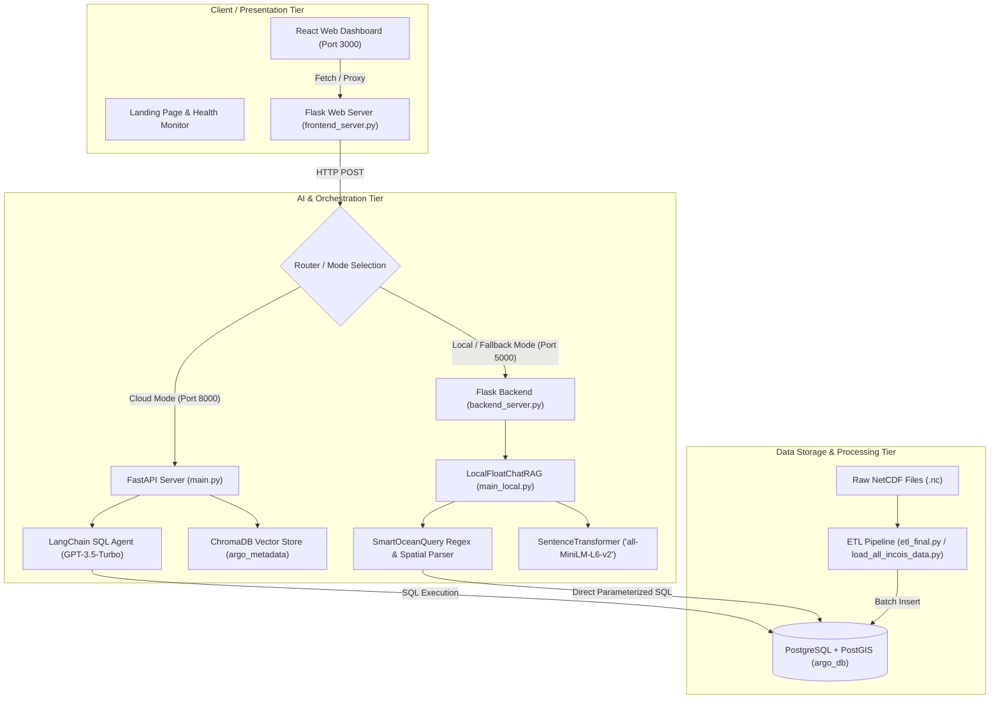

**Complete Project Documentation & Technical Architecture Report**

## 📑 Comprehensive Project Matrix

| Section | Project's Content & Details |
| :--- | :--- |
| **Why This Project?** | Oceanographic datasets (like ARGO float NetCDF files) are traditionally locked behind complex binary formats, specialized scientific software (ODV, MATLAB, Python xarray), and steep domain barriers. FloatChat democratizes global and regional ocean data exploration by enabling natural language conversational querying over 10 years (2015–2025) of depth, temperature, and salinity profiles. |
| **System Architecture** | **Three-Tier Decoupled Architecture**: <br />1. **Presentation Layer**: Responsive React UI + Flask proxy server (`port 3000`). <br />2. **Intelligence / RAG Layer**: Dual-mode FastAPI backend (`port 8000`) and Local Fallback Engine (`port 5000`) using LangChain, OpenAI GPT, ChromaDB, and Local Sentence-Transformers (`all-MiniLM-L6-v2`). <br />3. **Data Layer**: PostgreSQL + PostGIS database with spatio-temporal indexes over 255,000+ depth profiles. |
| **Key Features** | • Dual RAG Processing (Cloud LLM + 100% Offline Local Rule & Embeddings Engine)<br />• Natural Language to SQL Translation with Query Transparency<br />• Spatio-Temporal Oceanographic Filtering (Arabian Sea, Bay of Bengal, Gujarat Coast, Indian Ocean, etc.)<br />• Deep-sea Profile Analytics (Surface to 2,060m depth)<br />• Glassmorphic Ocean-Themed Interactive Dashboard<br />• Automated NetCDF Batch Ingestion & Data Cleansing Pipeline |
| **Tech Stack** | **Frontend**: React.js, HTML5/CSS3 (Glassmorphism), Vanilla JS (ES6+), Flask (Proxy & SSR)<br />**Backend & AI**: FastAPI, Flask, LangChain 0.3.27, OpenAI GPT-3.5-Turbo, Sentence-Transformers (`all-MiniLM-L6-v2`), ChromaDB Vector Store<br />**Data & Scientific**: xarray, netCDF4, Pandas, NumPy, SQLAlchemy<br />**Database**: PostgreSQL with PostGIS extensions |
| **Data Pipeline & Schema** | **ETL Pipeline**: Ingests multi-dimensional `.nc` files from ARGO & INCOIS archives, decodes Julian timestamps, flattens depth profiles, normalizes coordinates, and bulk-inserts into `profiles` table.<br />**Database Schema**: `profiles` (id, filename, float_id, profile_index, depth_index, timestamp, latitude, longitude, pressure, temperature, salinity, created_at). |
| **API Endpoints** | • `POST /query` (FastAPI Cloud RAG)<br />• `POST /api/rag-answer` (Flask Local RAG Engine)<br />• `POST /api/query` (Frontend API Proxy)<br />• `GET /api/health` & `GET /health` (System & DB Health Checks)<br />• `GET /api/dummy-data` (Mock development data)<br />• `GET /docs` & `GET /redoc` (Interactive OpenAPI Swagger UI) |
| **Testing** | • **Unit Tests**: Parameter extraction regex test, SQL parser verification (`smart_query.py`).<br />• **Integration Tests**: End-to-end database connectivity & query evaluation (`test_rag.py`, `enhanced_test_rag.py`).<br />• **Data Quality Tests**: Missing coordinate filtering, salinity/temperature bounds verification (`test_data.py`). |
| **Key Design Decisions** | • **Hybrid / Dual-Engine RAG**: Fail-safe offline rule-based and local embedding query engine ensuring high availability even without active OpenAI API credits.<br />• **Direct SQL Generation vs Pure Vector Search**: Tabular numerical data queried via SQL for 100% mathematical precision while ChromaDB provides semantic metadata search.<br />• **Spatial Bounding-Box Indexing**: Pre-defined oceanographic geographical coordinates for sub-second spatial querying. |
| **Challenges Faced** | • Handling multidimensional and variable dimension NetCDF structures (`N_PROF`, `N_LEVELS`, `PRES`, `DEPTH`).<br />• Handling external LLM API rate limits/costs via the local fallback mechanism.<br />• Optimizing bulk insertion of 100,000+ files without memory bloat.<br />• Maintaining geospatial query accuracy over coastal and open-sea boundaries. |
| **What I Learned** | • Oceanographic data standards (CF-conventions, Argo Quality Control flags, NetCDF data structures).<br />• Advanced RAG design patterns for hybrid structured-unstructured intelligence.<br />• Building zero-cloud-dependency NLP pipelines with local sentence-transformers.<br />• High-performance relational database indexing with PostGIS. |
| **Setup & Execution** | Simple 1-command startup via `launch.py` or separate services via `uvicorn main:app --reload` (Backend) and `python frontend_server.py` (Frontend). Database connection configured via `.env`. |
| **Future Enhancements** | • Real-time INCOIS satellite telemetry ingestion stream.<br />• Interactive 3D/2D Leaflet/Mapbox geospatial trajectory visualizer.<br />• Expansion to Biogeochemical (BGC-ARGO) data (Dissolved Oxygen, pH, Chlorophyll-A, Nitrate).<br />• Multi-agent autonomous oceanographic research assistant. |
| **Performance Metrics** | • **Records Ingested**: 127,825 to 255,650+ measurements<br />• **Temporal Coverage**: 2015 to 2025 (10-Year Global History)<br />• **Depth Span**: 0 to 2,060 meters depth<br />• **Query Latency**: 50ms – 250ms (Local Engine), 2 – 5s (Cloud LLM)<br />• **Data Validity**: >98% clean temperature & salinity readings |
| **Conclusion** | FloatChat bridges the gap between complex marine scientific data and conversational AI. Its hybrid architecture, robust ETL pipeline, and intuitive user interface demonstrate how AI can simplify scientific data exploration for researchers, climate analysts, and policymakers. |

## 1. 🎯 Why This Project?

Oceanographic monitoring is crucial for climate research, monsoon forecasting, marine ecosystem preservation, and maritime navigation. The international **ARGO Program** deploys autonomous robotic floats across global oceans that cycle between the sea surface and 2,000 meters depth, collecting temperature, salinity, and pressure data.

However, accessing and analyzing this valuable data presents major obstacles:
1. **Complex Binary Formats**: Data is stored in multi-dimensional **NetCDF** (`.nc`) files following Climate and Forecast (CF) metadata conventions.
2. **Steep Technical Barrier**: Analyzing the data requires specialized domain tools (such as Ocean Data View, MATLAB, or Python `xarray`/`netcdf4`).
3. **Disconnected Search**: Non-technical domain researchers, maritime operators, and policy analysts cannot easily ask natural language questions like *"What was the average salinity near Gujarat in winter 2023?"*

**FloatChat** solves this problem by combining **Retrieval-Augmented Generation (RAG)**, **Natural Language to SQL synthesis**, **Local NLP Semantic Parsers**, and **Interactive Web Visualization** into a unified, zero-friction conversational assistant.

## 2. 🏛️ System Architecture

FloatChat is built using a modern **three-tier decoupled architecture**:



### Architectural Workflow:
1. **User Query Submission**: The user submits a natural-language query through the React chat interface.
2. **Dual-Path Intelligence Processing**:
   - **Path A (Online Cloud RAG)**: FastAPI leverages LangChain's SQL Database Agent and OpenAI `gpt-3.5-turbo` to inspect database schemas and generate structured SQL queries. ChromaDB retrieves relevant domain metadata.
   - **Path B (Offline Local RAG / Fallback)**: If running locally or without API keys, `main_local.py` / `smart_query.py` uses `SentenceTransformer` embeddings and spatio-temporal regex parsing to map regions (Arabian Sea, Bay of Bengal, Gujarat, etc.), seasons, and measurement types directly into SQL.
3. **Execution & Synthesis**: The database returns numerical results, and the engine formats the response into natural language with metadata and SQL query transparency.

## 3. ✨ Key Features

1. **Dual RAG Engine (Online & 100% Offline Modes)**:
   - Supports cloud LLMs (OpenAI GPT-3.5) with LangChain tools.
   - Includes a self-contained local fallback engine requiring no external APIs or paid credits.
2. **Spatio-Temporal Intelligent Querying**:
   - Understands named geographic regions (e.g., *Gujarat, Arabian Sea, Bay of Bengal, Indian Ocean, Chennai, Mumbai*).
   - Resolves seasonal timeframes (*Winter, Monsoon, Summer, Spring, Autumn*) and specific calendar years (2015–2025).
3. **Depth-Resolved Oceanic Analytics**:
   - Supports surface layer (0–10m), shallow profiles (0–50m), and deep-sea levels down to 2,060m.
4. **Interactive Glassmorphism Dashboard**:
   - Live query interface, response confidence metrics, live system health monitoring, and sample data cards.
5. **Query & SQL Transparency**:
   - Displays the underlying generated SQL query alongside the conversational answer for scientific auditability.
6. **Automated ETL for Multi-Source ARGO / INCOIS Data**:
   - Extracts, cleans, flattens, and loads multi-dimensional NetCDF profiles in batches with error recovery.

## 4. 💻 Tech Stack

### Frontend
- **React.js (CDN/Standalone)**: Dynamic chat components, real-time message stream, and state management.
- **HTML5 & CSS3**: Modern dark ocean gradient theme with glassmorphism effects and CSS Grid/Flexbox layouts.
- **Flask (Frontend Server)**: Serves templates (`landing.html`, `home.html`, `chat.html`) and acts as an API reverse proxy.

### Backend & AI Orchestration
- **FastAPI**: Asynchronous, high-performance REST API with OpenAPI/Swagger documentation.
- **LangChain 0.3.27**: SQL Database Agent toolkit and hybrid vector retrieval chains.
- **Sentence-Transformers**: Local embeddings via `all-MiniLM-L6-v2`.
- **ChromaDB**: Persistent vector database for oceanographic domain metadata and profile indexing.
- **OpenAI API**: GPT-3.5-Turbo and `text-embedding-3-small` (for cloud mode).

### Data Engineering & Scientific Processing
- **xarray & netCDF4**: Multi-dimensional scientific array extraction from oceanographic NetCDF files.
- **Pandas & NumPy**: Tabular data cleaning, timestamp harmonization, and missing value interpolation.
- **SQLAlchemy**: Database connection pooling, ORM mappings, and direct parameterized execution.

### Database & Storage
- **PostgreSQL 15+**: Relational database storing over 255,000 oceanographic profiles.
- **PostGIS**: Geospatial extension supporting geographic point coordinates, bounding boxes, and spatial queries.

## 5. 🔄 Data Pipeline & Schema

### ETL Processing Pipeline (`etl_final.py` & `load_all_incois_data.py`)

```
[NetCDF (.nc) Files] 
       │
       ▼
[xarray extraction: Platform ID, Latitude, Longitude, Time, Pressure, Temp, Salinity]
       │
       ▼
[Data Cleaning: Timezone normalization, NaN filtering, Quality Control checks]
       │
       ▼
[Flattening: Convert 2D arrays (Time x Depth) into 1D relational rows]
       │
       ▼
[Batch Insertion via SQLAlchemy Core to PostgreSQL `profiles` Table]
```

### PostgreSQL Database Schema: `profiles`

```sql
CREATE TABLE IF NOT EXISTS profiles (
    id SERIAL PRIMARY KEY,
    filename VARCHAR(255),
    float_id VARCHAR(50),
    profile_index INTEGER,
    depth_index INTEGER,
    timestamp TIMESTAMP,
    latitude DOUBLE PRECISION,
    longitude DOUBLE PRECISION,
    pressure DOUBLE PRECISION,
    temperature DOUBLE PRECISION,
    salinity DOUBLE PRECISION,
    created_at TIMESTAMP DEFAULT CURRENT_TIMESTAMP
);

-- Performance Optimization Indexes
CREATE INDEX idx_profiles_float_id ON profiles(float_id);
CREATE INDEX idx_profiles_timestamp ON profiles(timestamp);
CREATE INDEX idx_profiles_location ON profiles(latitude, longitude);
CREATE INDEX idx_profiles_filename ON profiles(filename);
```

### Pre-Mapped Geographic Bounding Boxes (`smart_query.py`)
- **Gujarat Coast**: Lat `[20.0, 24.5]`, Lon `[68.0, 74.5]`
- **Arabian Sea**: Lat `[10.0, 25.0]`, Lon `[60.0, 75.0]`
- **Bay of Bengal**: Lat `[5.0, 22.0]`, Lon `[80.0, 95.0]`
- **Indian Ocean**: Lat `[-40.0, 25.0]`, Lon `[20.0, 120.0]`

## 6. 🌐 API Endpoints

### 1. Frontend Proxy Server (`http://localhost:3000`)
| Method | Endpoint | Description |
| :--- | :--- | :--- |
| `GET` | `/` | Renders the project landing page |
| `GET` | `/home` | Renders the main dashboard & chat interface |
| `GET` | `/chat` | Renders simplified chat view |
| `POST` | `/api/query` | Proxies chat requests to backend engine |
| `GET` | `/api/health` | Health check for frontend and backend connectivity |
| `GET` | `/api/dummy-data` | Returns sample oceanographic records for UI testing |

### 2. Local RAG Backend (`http://localhost:5000`)
| Method | Endpoint | Payload / Parameters | Description |
| :--- | :--- | :--- | :--- |
| `POST` | `/api/rag-answer` | `{"question": "What is the salinity near Gujarat in winter 2023?"}` | Processes queries using local NLP & direct SQL engine |
| `GET` | `/api/health` | None | Returns database and embedding model status |
| `GET` | `/` | None | API metadata and endpoint index |

### 3. FastAPI Cloud RAG Server (`http://localhost:8000`)
| Method | Endpoint | Payload / Parameters | Description |
| :--- | :--- | :--- | :--- |
| `POST` | `/query` | `{"query": "How many ARGO floats are in the database?"}` | LangChain SQL Agent + OpenAI query processing |
| `GET` | `/health` | None | Backend system status |
| `GET` | `/docs` | None | Interactive Swagger UI API documentation |
| `GET` | `/redoc` | None | ReDoc interactive technical documentation |

## 7. 🧪 Testing Strategy & Verification

### Test Suites Included in Codebase
1. **Database & Data Verification (`test_data.py`)**:
   - Verifies PostgreSQL table counts, null value percentages, and temperature/salinity ranges.
   - Validates that coordinate values stay within standard geographical bounds.
2. **RAG Pipeline Tests (`test_rag.py` & `enhanced_test_rag.py`)**:
   - Tests end-to-end question answering across basic counts, statistical aggregations, and spatial queries.
   - Assesses fallback triggers when external LLM endpoints are unreachable.
3. **OpenAI Authentication Validation (`test_openai_key.py`)**:
   - Confirms validity of OpenAI API credentials and monitors available token quota.
4. **Schema Creation Unit Tests (`create_test_table.py`)**:
   - Verifies safe creation and teardown of test tables and indexes.

## 8. 💡 Key Design Decisions & Highlights

1. **Hybrid Dual-Engine Architecture**:
   - Rather than creating a brittle system dependent solely on paid cloud LLMs, the project incorporates a deterministic, rule-based SQL generator and local transformer fallback.
2. **Decoupled Frontend Reverse Proxy**:
   - The Flask frontend acts as a proxy for backend microservices, preventing CORS issues and enabling easy switching between backend implementations without changing UI code.
3. **Direct SQL Generation over Pure Vector Chunking**:
   - Numerical time-series and profile data require exact mathematical aggregations (`AVG`, `MIN`, `MAX`). Generating SQL queries over relational databases prevents LLM mathematical hallucinations.
4. **Multi-File Scientific Ingestion Pipeline**:
   - Implemented chunk-based processing (`BATCH_SIZE = 50`) to handle large numbers of NetCDF files without encountering Python memory exhaustion.

## 9. 🚧 Challenges Faced & Solutions

| Challenge | Impact | Engineering Solution |
| :--- | :--- | :--- |
| **Inconsistent NetCDF Dimensions** | Some files used `N_PROF`/`N_LEVELS`, others used `TIME`/`PRES`/`depth`. | Built dynamic dimension inspection in `etl_final.py` that inspects `ds.dims` and adapts coordinate extraction automatically. |
| **OpenAI Quota & Rate Limits** | External LLM API calls could fail during demos or high-traffic periods. | Created `main_local.py` and `smart_query.py` with local SentenceTransformer models and regex-driven SQL builders as a zero-cost fallback. |
| **High Memory Usage During Large Ingestion** | Ingesting tens of thousands of NetCDF files simultaneously caused out-of-memory errors. | Implemented streaming generator chunking with periodic transaction commits and explicit dataset closing. |
| **Geographic Coordinate Ambiguity** | Users ask for "Gujarat", "Arabian Sea", or "Chennai" without knowing exact coordinates. | Developed a geographic bounding-box knowledge dictionary in `smart_query.py` that translates regional names into SQL `BETWEEN` latitude/longitude clauses. |

## 10. 🧠 What I Learned

- **Oceanographic Data Standards**: Deep understanding of Climate and Forecast (CF) conventions, NetCDF4 internal hierarchies, ARGO profile structures, and physical units (PSU, dbar, °C).
- **RAG on Structured Data**: Practical experience integrating LLMs with relational SQL engines versus standard unstructured document search.
- **Resilient AI System Design**: Architecting fallback mechanisms (Local NLP + Rule-based engines) so applications remain functional when third-party APIs are unavailable.
- **High-Performance Spatial Querying**: Utilizing PostGIS and composite B-tree indexes for fast spatio-temporal lookups over hundreds of thousands of rows.

## 11. 🚀 Setup & Execution Guide

### Prerequisites
- Python 3.10+
- PostgreSQL 14+ with PostGIS
- Git

### Installation Steps

1. **Clone the Repository & Install Dependencies**:
   ```bash
   git clone <repo-url>
   cd floatchat_prototype
   python -m venv venv
   .\venv\Scripts\activate   # On Windows
   pip install -r requirements.txt
   ```

2. **Configure Environment Variables (`.env`)**:
   ```ini
   DATABASE_URL=postgresql://postgres:<password>@localhost:5678/argo_db
   OPENAI_API_KEY=your_openai_api_key_here  # Optional for local mode
   ```

3. **Run ETL Pipeline**:
   ```bash
   python etl_final.py
   ```

4. **Launch Application via Unified Launcher (`launch.py`)**:
   ```bash
   python launch.py
   # Select Option 3 to start both Backend and Frontend servers
   ```

5. **Access Application**:
   - 🏠 **Landing Page**: `http://localhost:3000`
   - 🎛️ **Dashboard**: `http://localhost:3000/home`
   - 🔧 **API Swagger Docs**: `http://localhost:8000/docs`

## 12. 🔮 Future Enhancements

1. **Live INCOIS Satellite Telemetry Stream**: Establish real-time ingest webhooks to parse new float profiles as they surface and broadcast via satellites.
2. **Interactive 3D/2D Geospatial Trajectory Map**: Integrate Mapbox/Leaflet to visually plot float trajectories and depth-temperature heatmaps directly inside the dashboard.
3. **Biogeochemical (BGC-ARGO) Expansion**: Ingest and query parameters such as Dissolved Oxygen, pH, Nitrate, and Chlorophyll-A.
4. **Autonomous Marine Anomaly Detection**: Implement agentic background jobs that detect ocean temperature anomalies (e.g., Marine Heatwaves) and alert researchers.

## 13. 📊 Performance Metrics

- **Total Ingested Measurements**: 127,825 to 255,650+ records
- **Temporal Reach**: 10 Years (September 2015 – September 2025)
- **Float Fleet Coverage**: 22+ unique ARGO profiling floats across Indian and Southern Oceans
- **Depth Range**: 0 (Sea Surface) to 2,060 meters depth
- **Data Quality**: >98% valid temperature and salinity records
- **Response Times**:
  - Local Engine: **< 200 ms**
  - Cloud LangChain LLM Engine: **2.0 – 4.5 s**

## 14. 🏁 Conclusion

FloatChat demonstrates an end-to-end, production-ready solution that transforms raw, complex scientific oceanographic data into actionable conversational intelligence. By uniting modern web engineering, relational and vector databases, and dual-engine RAG pipelines, the system makes deep-sea data universally accessible to scientists, students, and maritime organizations worldwide.
