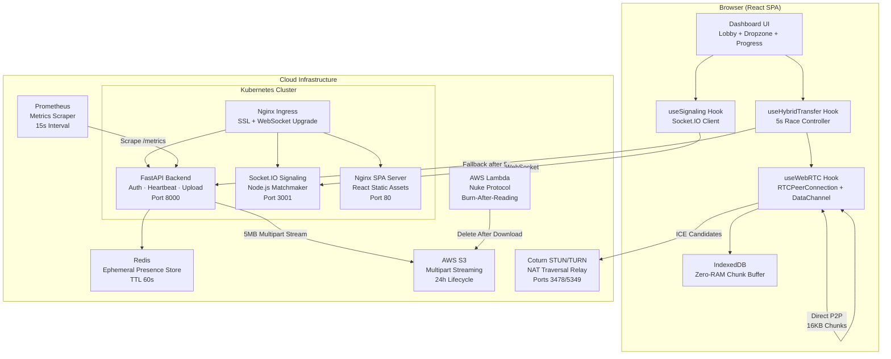
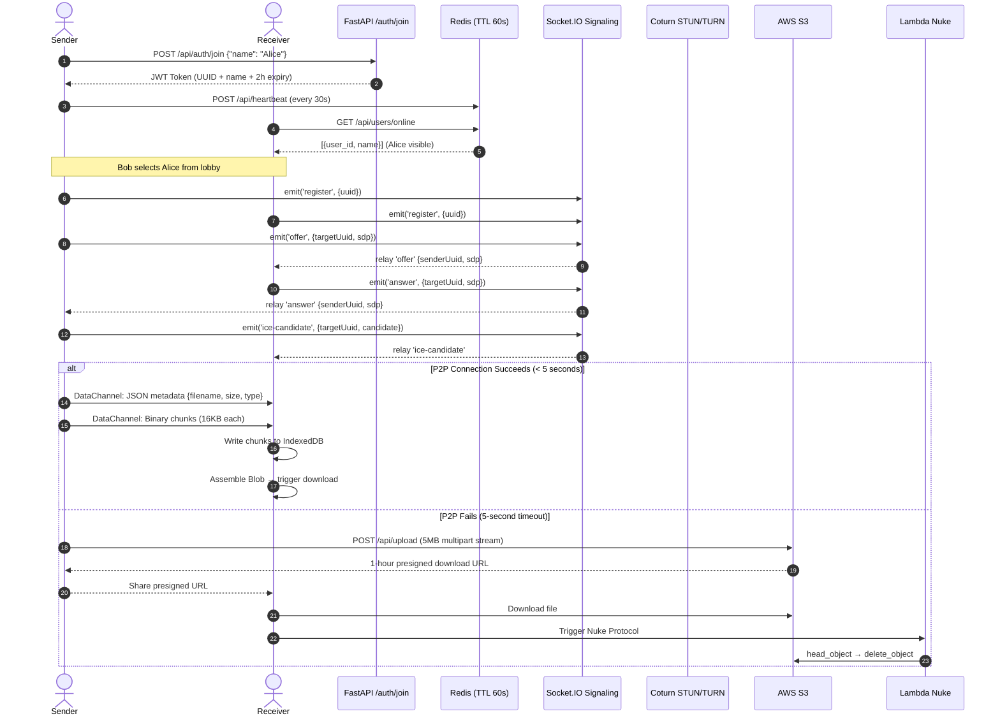
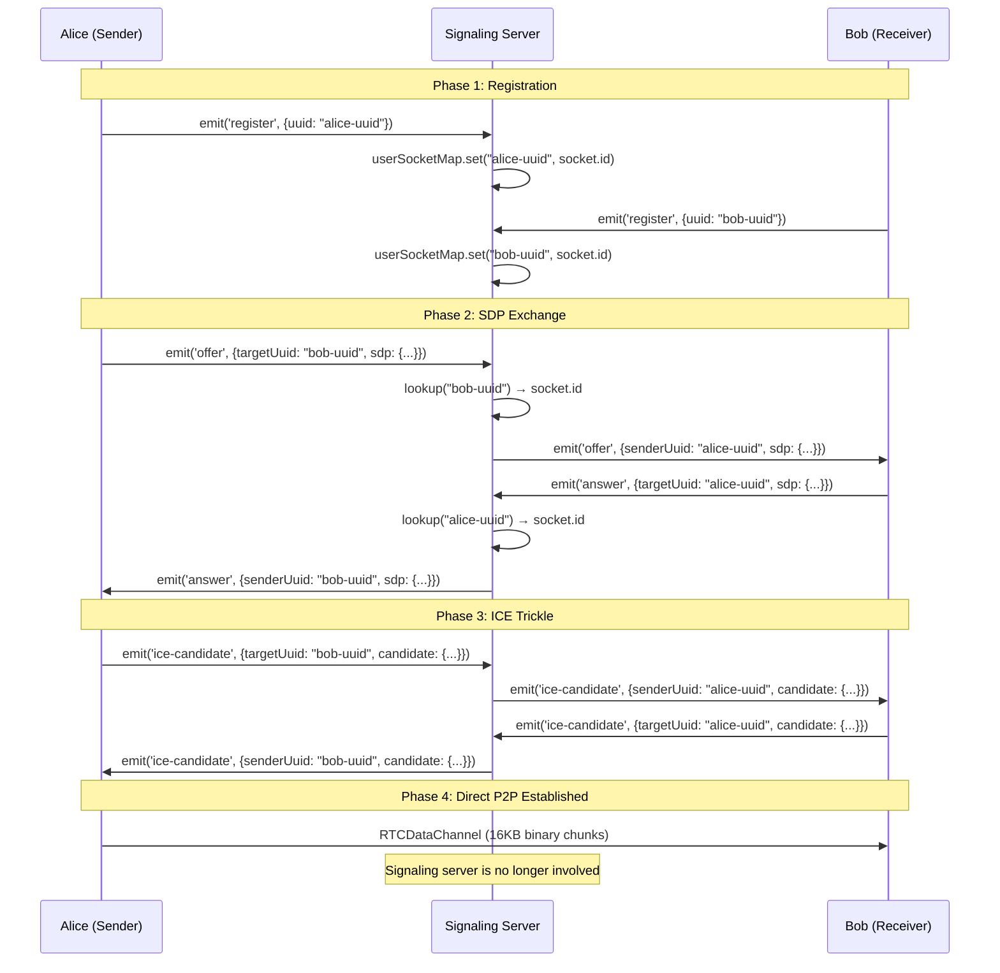
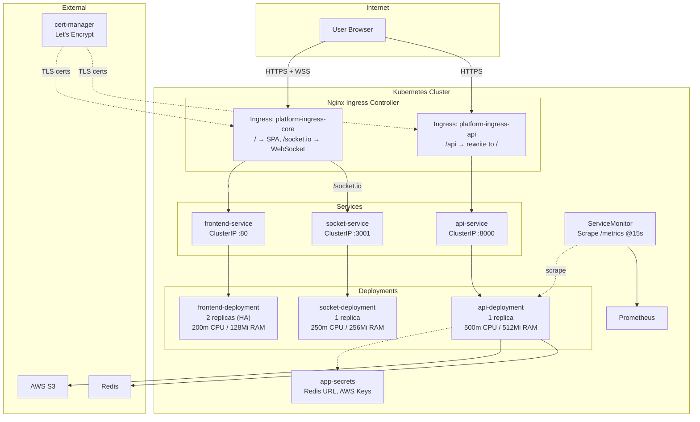

> A production-grade, privacy-first file transfer platform that races WebRTC peer-to-peer connections against cloud relay — and self-destructs the evidence.

## Why This Project?

Every day, millions of people transfer files using platforms like WeTransfer, Google Drive, or Dropbox. But here's the uncomfortable truth: **every one of those files passes through a corporate server**, gets stored on infrastructure you don't control, and stays there longer than you'd like.

I wanted to challenge that model with a fundamental question:

> *What if file transfers could happen directly between browsers — no middleman, no storage, no trace?*

That question led me down the rabbit hole of **WebRTC DataChannels**, **NAT traversal**, **STUN/TURN relay servers**, and the brutal reality that **peer-to-peer connections fail more often than they succeed** in the real world. Corporate firewalls, symmetric NATs, carrier-grade NATs — the internet is designed to *prevent* direct connections between devices.

So I built a system that **treats network connectivity as a probability, not a guarantee**:

- **Best case (P2P succeeds):** Files stream directly between browsers at LAN-like speeds. Zero servers touch the data. Zero copies exist anywhere.
- **Worst case (P2P fails):** The system silently pivots to streaming the file through AWS S3 with a 1-hour presigned URL — and then **destroys the file** via a serverless Lambda "Nuke Protocol" after download, backed by a 24-hour lifecycle failsafe.

This isn't a toy demo. It's a **production-grade distributed system** with Kubernetes manifests, Prometheus monitoring, non-root containers, multi-stage Docker builds, and a real deployment pipeline across Render, Railway, and self-hosted K8s.

## System Architecture

The platform follows a **microservices architecture** with three independently deployable services orchestrated behind a unified Nginx Ingress layer:



### Three-Tier Transfer Hierarchy

The system implements a **cascading fallback strategy** that prioritizes privacy:

| Priority | Route | Latency | Privacy | When It's Used |
|:---:|:---|:---|:---|:---|
| 1 | **WebRTC Direct P2P** | Lowest | Maximum (zero server contact) | Both peers on open/cone NAT |
| 2 | **TURN Relay via Coturn** | Medium | High (encrypted relay, no storage) | One or both peers behind restricted NAT |
| 3 | **AWS S3 Cloud Upload** | Highest | Moderate (temporary storage, auto-destruct) | WebRTC completely fails (symmetric NAT, firewall) |

## Architecture Highlights

### 1. The 5-Second Race Algorithm

The heart of the system is the **hybrid transfer controller** (`useHybridTransfer` hook). Instead of waiting indefinitely for WebRTC to negotiate, it runs an aggressive race:

```
┌─────────────────────────────────────────────────┐
│  startTransfer(file)                            │
│  ┌─────────────────────────────────────┐        │
│  │ State: p2p_pending                  │        │
│  │ → connectAndOffer()                 │        │
│  │ → Start 5-second countdown ⏱️       │        │
│  └──────────┬──────────────┬───────────┘        │
│             │              │                    │
│    P2P connected       Timer expires            │
│    before 5s?          (5 seconds)              │
│        │                   │                    │
│    ┌───▼───┐          ┌────▼────┐               │
│    │ p2p   │          │ cloud   │               │
│    │ active│          │ active  │               │
│    └───┬───┘          └────┬────┘               │
│        │                   │                    │
│  sendFile() via       POST /upload              │
│  DataChannel          multipart/form-data       │
│  (16KB chunks)        (5MB S3 streaming)        │
│        │                   │                    │
│    ┌───▼───────────────────▼───┐                │
│    │     State: completed      │                │
│    └───────────────────────────┘                │
└─────────────────────────────────────────────────┘
```

**Why 5 seconds?** WebRTC ICE negotiation typically completes in 1-3 seconds on open networks. A 5-second window gives STUN enough time to probe, but doesn't leave the user staring at a spinner when they're behind a corporate firewall that will *never* allow P2P.

### 2. Zero-RAM Chunk Buffering with IndexedDB

Traditional file transfer implementations accumulate received chunks in a JavaScript array — which means a 500MB file consumes 500MB of browser RAM. At scale, this crashes tabs.

This engine writes every incoming 16KB DataChannel chunk **directly to IndexedDB** (`TransferCache` object store), bypassing RAM entirely. The browser's IndexedDB implementation writes to disk, keeping memory usage flat regardless of file size. Only at the final step does it read all chunks back, assemble a `Blob`, and trigger the download.

### 3. Burn-After-Reading Data Destruction

Cloud-relayed files are protected by a **three-layer destruction cascade**:

| Layer | Mechanism | Trigger | Latency |
|:---:|:---|:---|:---|
| 1 | `abort_multipart_upload` | Upload failure mid-stream | Immediate |
| 2 | AWS Lambda "Nuke Protocol" | Post-download deletion request | Seconds |
| 3 | S3 Lifecycle Policy | 24-hour automatic expiration | ≤ 24 hours |

Even if a user never triggers the Nuke Protocol, the file **cannot exist beyond 24 hours** — AWS enforces this at the infrastructure level.

### 4. Graceful Degradation at Every Layer

The system is designed to **never hard-fail**:

- **Redis unavailable?** → Falls back to an async `InMemoryStore` with `asyncio.Lock` and manual TTL eviction.
- **WebRTC blocked?** → 5-second timer triggers S3 cloud relay.
- **S3 upload fails mid-stream?** → `abort_multipart_upload` cleans up orphaned parts.
- **Container crashes?** → Kubernetes restarts the pod with resource limits preventing OOM cascading.

## Key Features

### 🔗 WebRTC Peer-to-Peer Transfer
- **RTCDataChannel** with binary chunking at **16KB** (SCTP maximum transmission unit sweet spot).
- **Backpressure flow control** using `bufferedAmountLowThreshold` (64KB) to prevent buffer exhaustion on slow connections.
- **ICE Trickle** with Google STUN (`stun:stun.l.google.com:19302`) and self-hosted **Coturn TURN** relay for NAT traversal.

### 🔀 Hybrid 5-Second Race Fallback
- Races P2P connection against a 5-second timer.
- Seamless pivot to cloud relay — the user sees only a badge change (`P2P Direct` → `Cloud Server Relay`).
- Dynamic progress bar changes gradient color based on active route.

### 👥 Anonymous Identity & Live Lobby
- Auto-generated hacker-style handles (`Hacker_4821`).
- JWT-based stateless sessions (HS256, 2-hour expiry).
- Redis ephemeral presence with 60-second TTL keys and 30-second heartbeat pulses.
- Real-time lobby showing online peers, updated every 10 seconds.

### ☁️ Zero-Disk S3 Streaming Upload
- `aioboto3` async multipart upload with **5MB chunk streaming** — files never touch the API server's disk or accumulate in memory.
- Returns 1-hour presigned download URLs.
- Three-layer file destruction (abort, Lambda nuke, 24h lifecycle).

### 📊 Prometheus Observability
- Auto-instrumented metrics via `prometheus-fastapi-instrumentator`.
- Kubernetes `ServiceMonitor` CRD scraping `/metrics` every 15 seconds.
- Request latency histograms, error rate counters, and throughput gauges out of the box.

### 🐳 Production Container Security
- All containers run as **non-root users** (`appuser`, `nginx`).
- Multi-stage Docker builds minimize attack surface (no build tools in production images).
- Kubernetes resource limits prevent memory leaks and CPU starvation.

### 🔌 Event-Driven Signaling
- Node.js Socket.IO server acting as a **pure relay** — it never sees file content, only SDP offers/answers and ICE candidates.
- In-memory `Map` for UUID-to-socket mapping with automatic cleanup on disconnect.

## Tech Stack

### Backend
| Technology | Purpose |
|:---|:---|
| **FastAPI** | Async Python REST API framework |
| **Uvicorn** | High-performance ASGI server |
| **Redis (async)** | Ephemeral presence store with TTL-based session tracking |
| **aioboto3 / botocore** | Async AWS SDK for zero-disk S3 multipart streaming |
| **PyJWT** | HS256 JWT token generation and validation |
| **python-multipart** | Streaming multipart form parser for file uploads |
| **Pydantic** | Request/response data validation and serialization |
| **prometheus-fastapi-instrumentator** | Auto-instrumented Prometheus metrics |

### Frontend
| Technology | Purpose |
|:---|:---|
| **React 18** | Component-based SPA framework |
| **Vite 5** | Lightning-fast HMR development server and bundler |
| **Tailwind CSS 3** | Utility-first dark theme styling |
| **Socket.IO Client** | WebSocket connection to signaling server |
| **Axios** | HTTP client for REST API and multipart uploads |
| **WebRTC APIs** | `RTCPeerConnection`, `RTCDataChannel`, ICE/SDP |
| **IndexedDB** | Zero-RAM binary chunk storage during file reception |

### Infrastructure
| Technology | Purpose |
|:---|:---|
| **Docker** | Multi-stage, non-root containerization |
| **Kubernetes** | Container orchestration with resource limits |
| **Nginx Ingress** | SSL termination, WebSocket upgrade, SPA routing |
| **Coturn** | Self-hosted STUN/TURN relay for NAT traversal |
| **AWS S3** | Temporary cloud file storage with lifecycle policies |
| **AWS Lambda** | Serverless burn-after-reading file deletion |
| **Prometheus** | Metrics collection via ServiceMonitor CRD |
| **Render / Railway** | PaaS deployment targets |
| **Let's Encrypt** | Automated SSL via cert-manager |

## Data Pipeline & Schema

### End-to-End Transfer Flow



### Data Storage Schema

#### Redis Presence Store
```
Key Pattern:   user_online:{uuid}
Value:         "{anonymous_name}"    (e.g., "Hacker_4821")
TTL:           60 seconds
Heartbeat:     Every 30 seconds (POST /api/heartbeat)
Scan Method:   SCAN (non-blocking) + batched MGET
```

#### S3 Object Layout
```
Path:          uploads/{user_id}/{uuid4}.{extension}
Metadata:      {"sender_uuid": "{user_id}"}
Presigned URL: GET, expires in 3600 seconds (1 hour)
Lifecycle:     Expiration after 1 day
Multipart:     AbortIncompleteMultipartUpload after 1 day
```

#### IndexedDB (Browser-Side)
```
Database:      TransferCache
Object Store:  chunks
Data:          Raw binary ArrayBuffer (16KB per entry)
Lifecycle:     Cleared after Blob assembly and download trigger
```

#### Pydantic Models
```python
class JoinRequest(BaseModel):
    anonymous_name: str          # e.g., "Hacker_4821"

class TokenResponse(BaseModel):
    access_token: str            # HS256 JWT
    token_type: str              # "bearer"
```

## API Endpoints

### REST API (FastAPI — Port 8000)

| Method | Endpoint | Auth | Request Body | Response | Purpose |
|:---:|:---|:---:|:---|:---|:---|
| `GET` | `/ping` | ❌ | — | `{"status": "ok", "message": "pong"}` | Health check |
| `GET` | `/metrics` | ❌ | — | Prometheus text format | Auto-instrumented metrics |
| `POST` | `/api/auth/join` | ❌ | `{"anonymous_name": "Hacker_4821"}` | `{"access_token": "eyJ...", "token_type": "bearer"}` | Anonymous session creation |
| `POST` | `/api/heartbeat` | ✅ | `{}` | `200 OK` | Refresh Redis presence TTL to 60s |
| `GET` | `/api/users/online` | ❌ | — | `[{"user_id": "uuid", "name": "Hacker_4821"}]` | List active peers |
| `POST` | `/api/upload` | ✅ | `multipart/form-data` (file) | `{"url": "https://s3...presigned"}` | S3 cloud fallback upload |

### WebSocket Signaling Events (Socket.IO — Port 3001)

| Event | Direction | Payload | Purpose |
|:---|:---:|:---|:---|
| `register` | Client → Server | `{uuid}` | Map UUID to socket ID |
| `offer` | Bidirectional | `{targetUuid, sdp}` | Relay WebRTC SDP offer |
| `answer` | Bidirectional | `{targetUuid, sdp}` | Relay WebRTC SDP answer |
| `ice-candidate` | Bidirectional | `{targetUuid, candidate}` | Trickle ICE candidates |
| `disconnect` | Auto | — | Clean up UUID mapping |

## Testing

### Current Testing Strategy

The project currently relies on **integration-level verification** rather than formal unit test suites:

| Method | What It Validates |
|:---|:---|
| `/ping` health check | Backend is alive and responsive |
| `start.py` orchestrator | All three services boot successfully and stay running |
| Process polling loop | Detects unexpected child process crashes during development |
| Manual browser testing | End-to-end P2P and cloud fallback transfer flows |
| Kubernetes liveness probes | Container health in production |
| Prometheus metrics | Request success/failure rates and latency distributions |

### Recommended Testing Roadmap

```
├── Unit Tests (pytest)
│   ├── test_auth.py          → JWT generation, expiry, invalid token handling
│   ├── test_redis_client.py  → InMemoryStore fallback, TTL eviction, scan
│   ├── test_uploads.py       → Multipart abort on failure, presigned URL format
│   └── test_security.py      → Bearer token extraction, 401 scenarios
│
├── Integration Tests
│   ├── test_signaling.py     → Socket.IO event relay (offer/answer/ice-candidate)
│   ├── test_presence.py      → Heartbeat → online listing → TTL expiry
│   └── test_s3_lifecycle.py  → Upload → presigned URL → Lambda deletion
│
└── E2E Tests (Playwright / Cypress)
    ├── test_lobby.cy.js      → Auto-registration, peer discovery, selection
    ├── test_p2p_transfer.js  → WebRTC negotiation, chunk transfer, download
    └── test_fallback.js      → Force P2P failure, verify cloud relay activation
```

## Key Design Decisions

### 1. Why 16KB DataChannel Chunks?

WebRTC DataChannels use **SCTP** (Stream Control Transmission Protocol) under the hood. SCTP has a maximum message size, and while browsers can fragment larger messages, crossing the ~64KB boundary triggers fragmentation that **destroys throughput**. 16KB sits well below this threshold while being large enough to minimize per-chunk overhead — the sweet spot between reliability and speed.

### 2. Why Redis Ephemeral Keys Instead of a Database?

User presence is inherently **temporal**. A user is either online right now, or they're not. Using a traditional database would require:
- Write on connect
- Write on every heartbeat
- Write on disconnect
- Scheduled cleanup for crashed clients that never sent a disconnect

Redis `SETEX` with a 60-second TTL eliminates all of this. If a client crashes, their key simply **evaporates**. No cleanup jobs, no stale data, no phantom users. The 30-second heartbeat interval provides a 2x safety margin.

### 3. Why `SCAN` Instead of `KEYS *`?

Redis is single-threaded. The `KEYS *` command scans the entire keyspace in one blocking operation — at scale, this can freeze Redis for seconds. `SCAN` returns results incrementally in cursor-based pages, keeping Redis responsive even with thousands of presence keys.

### 4. Why In-Memory Fallback for Redis?

Local development shouldn't require running Redis. The `InMemoryStore` class mirrors the Redis async API with `asyncio.Lock` for thread safety and manual TTL tracking. This means `python start.py` works out of the box with zero external dependencies.

### 5. Why `aioboto3` Instead of `boto3`?

Standard `boto3` is synchronous — it blocks the event loop during S3 uploads. For a FastAPI async backend, this would serialize all uploads through a single thread. `aioboto3` wraps boto3 operations in async context managers, allowing the server to handle multiple concurrent file uploads without blocking.

### 6. Why Separate Ingress Resources for API and Frontend?

Nginx Ingress regex rewrite annotations (`rewrite-target: /$2`) apply globally to all paths in an Ingress resource. If the frontend SPA route and the API route share the same Ingress, the regex rewrite **breaks static asset paths** (CSS, JS, images). Splitting into two Ingress resources — one with regex for `/api` rewrites, one without for `/` and `/socket.io` — prevents this collision.

### 7. Why `network_mode: "host"` for Coturn?

Docker's bridge networking translates ports through iptables NAT rules. WebRTC TURN relay requires dynamic UDP port allocation across the range `49152-65535`. Docker bridge NAT cannot efficiently handle this scale of dynamic port mapping and introduces latency. Host networking gives Coturn direct access to the host's network stack, eliminating this bottleneck.

### 8. Why IndexedDB Instead of In-Memory Arrays?

A JavaScript array holding 500MB of `ArrayBuffer` chunks will push the browser tab to **500MB+ of RAM**. IndexedDB writes to the browser's internal storage (typically LevelDB on disk), keeping RAM usage flat. This is the difference between "transfers files up to 50MB" and "transfers files of arbitrary size."

## Security Architecture

### Authentication Flow
```
Client                              Server
  │                                   │
  │  POST /api/auth/join              │
  │  {"anonymous_name": "X"}          │
  │ ─────────────────────────────►    │
  │                                   │ Generate UUID4
  │                                   │ Sign JWT (HS256)
  │                                   │   sub: uuid
  │                                   │   name: anonymous_name
  │                                   │   exp: now + 2 hours
  │  ◄─────────────────────────────   │
  │  {"access_token": "eyJ..."}       │
  │                                   │
  │  POST /api/heartbeat              │
  │  Authorization: Bearer eyJ...     │
  │ ─────────────────────────────►    │
  │                                   │ Decode JWT
  │                                   │ Verify HS256 signature
  │                                   │ Check expiration
  │                                   │ SETEX user_online:{uuid} 60
  │  ◄─────────────────────────────   │
  │  200 OK                           │
```

### Container Security Posture
- **Non-root execution** across all containers (`appuser:appgroup` for backend, `nginx:nginx` for frontend).
- **Multi-stage builds** strip build dependencies (Node.js, npm, pip) from production images.
- **Kubernetes resource limits** prevent any single pod from consuming cluster resources:
  - API: `500m` CPU / `512Mi` RAM max
  - Frontend: `200m` CPU / `128Mi` RAM max
  - Signaling: `250m` CPU / `256Mi` RAM max
- **AWS IAM least-privilege** — Lambda function has only `s3:DeleteObject` and `s3:GetObject` permissions.
- **No persistent credentials in containers** — secrets injected via Kubernetes `Secret` objects.

## Challenges Faced

### 1. The Symmetric NAT Problem
**Problem:** During testing, WebRTC connections worked perfectly on home networks but failed 100% of the time on mobile data and corporate networks. Symmetric NATs assign a *different* external port for every destination, making STUN-based hole punching impossible.

**Solution:** Deployed a self-hosted **Coturn TURN server** with `network_mode: "host"` to relay encrypted media when direct connections fail. Added the 5-second race timer so users don't wait indefinitely for connections that will never establish.

### 2. Railway Dynamic Port Injection
**Problem:** Railway assigns a random port via the `$PORT` environment variable at container startup. Hardcoding `--port 8000` in the Dockerfile caused the container to listen on the wrong port, making it unreachable behind Railway's reverse proxy.

**Solution:** Created `entrypoint.sh` that dynamically reads `$PORT` at runtime:
```bash
exec uvicorn app.main:app --host 0.0.0.0 --port "${PORT:-8000}"
```

### 3. Redis Connection Blocking the Event Loop
**Problem:** Early implementation used eager Redis pool initialization at import time. If Redis was slow or unreachable, the entire FastAPI startup would hang — blocking all endpoints, not just presence-related ones.

**Solution:** Implemented **lazy Redis initialization** wrapped in the `InMemoryStore` fallback. The Redis connection is attempted on first use, and if it fails, the in-memory store transparently takes over without crashing the server.

### 4. Browser RAM Exhaustion on Large Files
**Problem:** The initial WebRTC receiver implementation stored incoming chunks in a JavaScript `Array`. Transferring a 200MB file consumed 200MB+ of tab RAM, causing Chrome to kill the tab on mobile devices.

**Solution:** Pivoted to **IndexedDB chunk buffering**. Each 16KB chunk is written directly to the `TransferCache` object store on disk. RAM usage stays constant regardless of file size. The tradeoff is slightly slower assembly at the end, but the transfer itself never crashes.

### 5. DataChannel Buffer Overflow
**Problem:** Sending file chunks as fast as `FileReader` could read them caused the DataChannel's internal buffer to overflow, silently dropping chunks and corrupting transfers.

**Solution:** Implemented **backpressure control** using `bufferedAmountLowThreshold` (64KB). The sender pauses when the buffer exceeds this threshold and resumes via the `onbufferedamountlow` callback. This creates a natural flow control mechanism that adapts to network speed.

### 6. Nginx Ingress Regex vs. SPA Routing Collision
**Problem:** Using a single Kubernetes Ingress resource with regex rewrite (`/api(/|$)(.*)` → `/$2`) caused the frontend's static assets (JS, CSS) to be rewritten and return 404s.

**Solution:** Split into **two separate Ingress resources** — one handling `/api` with regex rewrites, and another handling `/` (SPA) and `/socket.io` (WebSocket) without rewrites.

### 7. S3 Orphaned Multipart Uploads
**Problem:** If a cloud upload failed midway (network timeout, client disconnect), the partially uploaded S3 multipart chunks would persist indefinitely, silently accumulating storage costs.

**Solution:** Three-layer cleanup:
1. **Immediate:** `abort_multipart_upload` in the `except` block of the upload handler.
2. **Lifecycle:** `AbortIncompleteMultipartUpload` rule set to 1 day via `setup_s3_lifecycle.py`.
3. **Manual:** Lambda function for on-demand cleanup.

## What I Learned

### Distributed Systems Are About Failure Modes
The most important code in this project isn't the happy path — it's the fallback logic. Every component has a failure mode, and the system's quality is defined by how gracefully it handles each one. I now think about every feature in terms of: *"What happens when this breaks?"*

### WebRTC Is Powerful but Hostile
WebRTC gives you browser-to-browser communication, but the internet actively fights direct connections. NAT traversal is a probabilistic game, not a deterministic protocol. Building a reliable product on WebRTC requires accepting that **P2P will fail** and having a seamless fallback ready.

### Async Python Changes Everything
Moving from synchronous `boto3` to `aioboto3`, from blocking Redis to `redis.asyncio` — these aren't just performance optimizations. They're architectural decisions that determine whether your server can handle 10 concurrent uploads or 1,000.

### Kubernetes Forces Good Architecture
Writing K8s manifests forced me to think about:
- **Resource limits** — What happens if my code leaks memory?
- **Health checks** — How does the cluster know my service is alive?
- **Secret management** — No more hardcoded credentials.
- **Scaling** — Can I run 2 replicas without breaking state?

### Browser APIs Are More Capable Than You Think
IndexedDB, WebRTC DataChannels, the File API, `Blob` construction — modern browsers are legitimate application platforms. You can build real distributed systems entirely in the browser with careful architecture.

### Security Is a Spectrum, Not a Checkbox
From non-root containers to least-privilege IAM policies to JWT expiration to S3 lifecycle rules — security isn't one thing you add at the end. It's dozens of small decisions made throughout the entire stack.

## Setup & Execution

### Option 1: One-Command Local Development

```bash
# Clone the repository
git clone https://github.com/your-repo/hybrid-p2p-engine.git
cd hybrid-p2p-engine

# Set up backend virtual environment
cd backend
python -m venv venv
venv\Scripts\activate        # Windows
# source venv/bin/activate   # Linux/macOS
pip install -r requirements.txt
cd ..

# Install frontend dependencies
cd frontend
npm install
cd ..

# Install signaling dependencies
cd signaling
npm install
cd ..

# Launch all three services simultaneously
python start.py
```

The `start.py` orchestrator will:
1. Boot the FastAPI backend on **port 8000** (with hot-reload)
2. Boot the Socket.IO signaling server on **port 3001**
3. Boot the Vite dev server on **port 5173**
4. Wait 4 seconds for services to initialize
5. Auto-open `http://localhost:5173` in your default browser
6. Monitor all processes and report crashes in real-time

> **Note:** If Redis isn't running locally, the backend automatically falls back to its `InMemoryStore` — no setup required.

### Option 2: Docker Containers

```bash
# Build all images
docker build -t hybrid-p2p/api:latest ./backend
docker build -t hybrid-p2p/frontend:latest ./frontend
docker build -t hybrid-p2p/socket:latest ./signaling

# Run with environment variables
docker run -d -p 8000:8000 \
  -e REDIS_URL=redis://your-redis:6379 \
  -e AWS_ACCESS_KEY_ID=your-key \
  -e AWS_SECRET_ACCESS_KEY=your-secret \
  -e S3_BUCKET_NAME=your-bucket \
  hybrid-p2p/api:latest

docker run -d -p 3001:3001 hybrid-p2p/socket:latest
docker run -d -p 80:80 hybrid-p2p/frontend:latest
```

### Option 3: Kubernetes Deployment

```bash
# Apply secrets
kubectl apply -f infrastructure/k8s/app-secrets.yaml

# Deploy all services
kubectl apply -f infrastructure/k8s/api-deployment.yaml
kubectl apply -f infrastructure/k8s/frontend-deployment.yaml
kubectl apply -f infrastructure/k8s/socket-deployment.yaml

# Set up ingress with SSL
kubectl apply -f infrastructure/k8s/ingress.yaml

# Enable Prometheus monitoring
kubectl apply -f infrastructure/k8s/api-servicemonitor.yaml
```

### Option 4: PaaS Deployment (Render)

Push to your Git repository — `render.yaml` auto-deploys:
- **Signaling server** → `p2p-signaling-server` (Node.js)
- **FastAPI backend** → `p2p-fastapi-backend` (Python 3.11)

### Environment Variables Reference

| Variable | Required | Default | Description |
|:---|:---:|:---|:---|
| `SECRET_KEY` | ✅ | — | JWT HS256 signing secret |
| `REDIS_URL` | ❌ | `None` (falls back to InMemoryStore) | Redis connection URI |
| `AWS_ACCESS_KEY_ID` | ✅ | — | AWS IAM access key |
| `AWS_SECRET_ACCESS_KEY` | ✅ | — | AWS IAM secret key |
| `AWS_REGION` | ✅ | `eu-north-1` | AWS region for S3 |
| `S3_BUCKET_NAME` | ✅ | — | Target S3 bucket name |
| `PORT` | ❌ | `8000` / `3001` | Dynamic port (Railway/Render) |

## WebRTC Signaling Protocol Deep Dive

The signaling server is intentionally minimal — it's a **pure relay** that never inspects or stores file data:



### Why Socket.IO Over Raw WebSockets?

Socket.IO provides **automatic reconnection**, **event namespacing**, and **transport fallback** (WebSocket → HTTP long-polling). In production behind corporate proxies that block WebSocket upgrades, Socket.IO's fallback keeps signaling functional.

## Kubernetes Deployment Architecture



## Future Enhancements

### Short-Term
| Enhancement | Impact |
|:---|:---|
| **JWT validation in signaling server** | Prevents UUID spoofing in WebSocket registration |
| **Automated test suite (pytest + Cypress)** | Catch regressions before deployment |
| **CI/CD pipeline (GitHub Actions)** | Automated build → test → deploy on push |
| **File encryption at rest** | AES-256 encryption before S3 upload |
| **Transfer history dashboard** | Track past transfers with timestamps and routes used |

### Medium-Term
| Enhancement | Impact |
|:---|:---|
| **Redis Adapter for Socket.IO** | Enable horizontal scaling of signaling to multiple replicas |
| **Multi-file & folder transfers** | Batch multiple files into a single transfer session |
| **Resume interrupted transfers** | Checkpoint-based recovery for large files |
| **End-to-end encryption (E2EE)** | Encrypt DataChannel payloads so even TURN relay is zero-knowledge |
| **QR code pairing** | Scan to connect — no lobby selection needed |

### Long-Term
| Enhancement | Impact |
|:---|:---|
| **Mesh networking (multi-peer)** | Transfer files to multiple recipients simultaneously |
| **Progressive Web App (PWA)** | Install as native app with offline queuing |
| **WebTransport migration** | Replace WebRTC DataChannel with HTTP/3 WebTransport for better performance |
| **Grafana dashboards** | Visualize transfer success rates, P2P vs. cloud ratio, latency percentiles |
| **Rate limiting & abuse prevention** | Token bucket rate limiting per JWT identity |

## Project File Structure

```
hybrid-p2p-engine/
│
├── backend/                          # FastAPI REST API
│   ├── Dockerfile                    # Multi-stage, non-root Python container
│   ├── entrypoint.sh                 # Dynamic $PORT injection for PaaS
│   ├── requirements.txt              # Python dependencies
│   ├── nixpacks.toml                 # Nixpacks build config
│   ├── railway.toml                  # Railway deployment config
│   └── app/
│       ├── main.py                   # FastAPI app, CORS, Prometheus
│       ├── api/
│       │   ├── auth.py               # POST /join — JWT creation
│       │   ├── uploads.py            # POST /upload — S3 multipart streaming
│       │   └── users.py              # POST /heartbeat, GET /users/online
│       ├── core/
│       │   ├── config.py             # Environment variable loading
│       │   └── security.py           # JWT encode/decode, Bearer dependency
│       ├── models/
│       │   └── user.py               # Pydantic schemas
│       └── services/
│           └── redis_client.py       # Async Redis + InMemoryStore fallback
│
├── frontend/                         # React SPA
│   ├── Dockerfile                    # Multi-stage Node → Nginx container
│   ├── nginx.conf                    # SPA fallback + asset caching
│   ├── vite.config.js                # Vite + React plugin
│   ├── tailwind.config.js            # Tailwind CSS config
│   ├── package.json                  # Node dependencies
│   └── src/
│       ├── main.jsx                  # React DOM mount
│       ├── App.jsx                   # Root component
│       ├── Dashboard.jsx             # Lobby + Dropzone + Progress UI
│       ├── index.css                 # Tailwind directives
│       └── hooks/
│           ├── useSignaling.js       # Socket.IO + heartbeat management
│           ├── useWebRTC.js          # RTCPeerConnection + IndexedDB buffer
│           └── useHybridTransfer.js  # 5-second P2P/Cloud race controller
│
├── signaling/                        # WebRTC Signaling Microservice
│   ├── Dockerfile                    # Node 18 Alpine container
│   ├── index.js                      # Socket.IO event relay server
│   ├── package.json                  # Express + Socket.IO + CORS
│   ├── nixpacks.toml                 # Nixpacks config
│   └── railway.toml                  # Railway config
│
├── infrastructure/                   # Cloud & K8s Infrastructure
│   ├── coturn/
│   │   └── docker-compose.yml        # STUN/TURN relay server
│   ├── k8s/
│   │   ├── api-deployment.yaml       # Backend K8s Deployment + Service
│   │   ├── frontend-deployment.yaml  # Frontend K8s Deployment + Service
│   │   ├── socket-deployment.yaml    # Signaling K8s Deployment + Service
│   │   ├── ingress.yaml              # Dual Nginx Ingress (API + Core)
│   │   ├── app-secrets.yaml          # Kubernetes Secrets
│   │   └── api-servicemonitor.yaml   # Prometheus ServiceMonitor CRD
│   ├── lambda/
│   │   ├── nuke_protocol.py          # Burn-after-reading S3 deletion
│   │   └── iam_policy.json           # Least-privilege Lambda IAM policy
│   └── scripts/
│       └── setup_s3_lifecycle.py     # S3 24h expiration + multipart abort
│
├── start.py                          # Local dev orchestrator (all 3 services)
├── render.yaml                       # Render PaaS multi-service deployment
├── Steps.txt                         # Implementation checklist (18/18 complete)
└── .gitignore                        # Dependency & env exclusions
```

## Conclusion

The **Hybrid P2P-Cloud Anonymous Transfer Engine** isn't just a file transfer tool — it's a case study in building resilient distributed systems that respect user privacy.

At its core, the project embodies a single architectural philosophy: **hope for the best, plan for the worst**. WebRTC gives us the *possibility* of direct, private, zero-server file transfers. But the internet is messy — firewalls block, NATs restrict, connections drop. Instead of pretending these problems don't exist, this system embraces them as first-class design constraints.

The result is a platform where:
- **Every transfer starts with maximum privacy** (direct P2P attempt)
- **Every failure is handled gracefully** (automatic cloud fallback)
- **Every cloud-stored file has a death sentence** (Lambda nuke + 24h lifecycle)
- **Every component can fail independently** (Redis fallback, multipart abort, K8s restart policies)
- **Every container runs with minimum privilege** (non-root, resource-limited, secret-injected)

Building this project taught me that the gap between "it works on my machine" and "it works in production" is vast — and that gap is filled with NAT traversal failures, dynamic port injection, regex rewrite collisions, buffer overflow bugs, and orphaned cloud storage. Each of those challenges made the system — and me as an engineer — more robust.

Whether you're interested in WebRTC, distributed systems, cloud architecture, or container security, I hope this deep dive gave you something to think about. The code is open — feel free to explore, break things, and build something better.

*Built with FastAPI · React · WebRTC · Socket.IO · AWS S3 · Redis · Kubernetes · Docker · Prometheus*
